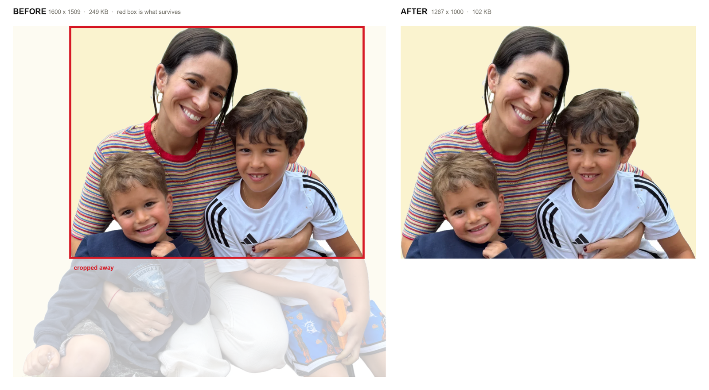
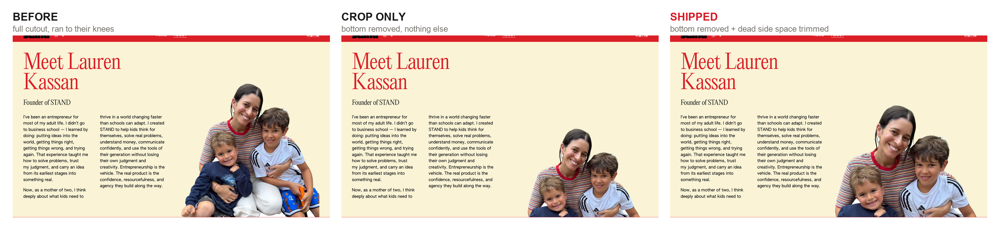
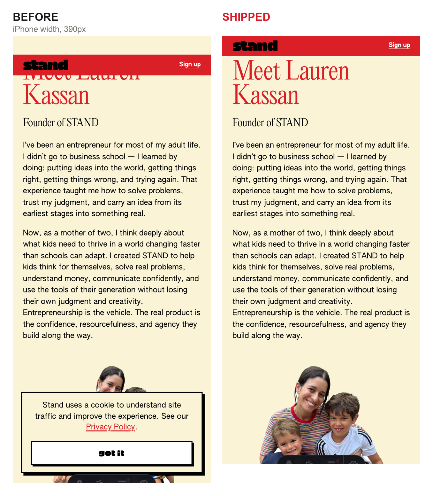

# Meet Lauren photo — crop review

Lauren, Sep 14: *"Can you crop this photo to be more ike size (removing the bottom half pls)."*

Done, and live on the About page preview:
**https://stand-marketing-doej2ajzi-standkidsapp.vercel.app/about**

The change is on PR #53.

---

## 1. The photo itself

The original ran down to the boys' knees. It now stops just below the younger boy's fist.

The red box is what survives. The bottom went because Lauren asked for it. The transparent margins on the left and right went too — see the next section for why.

---

## 2. On the page, desktop

The middle panel is the literal request: cut the bottom, change nothing else. It has a problem. The image sits in a box capped at 656px wide, so making the photo shorter doesn't move it — it just leaves the family stranded in the bottom-right corner with a cream hole where the headline used to be balanced.

The right panel also trims the transparent side margins, which were never doing anything. That lets the family fill the column instead of floating inside it. Same crop, same photo, no extra content lost. This is what shipped.

**Pick the middle one instead if Lauren wanted the photo to feel smaller overall, not just shorter.** It's a one-line change.

---

## 3. On the page, mobile

---

## One thing I couldn't read

"more ike size" — I took it as "more like a normal photo size", i.e. not a full-body cutout. If she meant something specific by it, say so and I'll recut.

---

## Numbers

| | Before | After |
|---|---|---|
| File | 1600 x 1509, 249 KB | 1267 x 1000, 102 KB |
| Rendered at 1440px | 644 x 607 | 644 x 508 |
| Rendered at 390px | 245 x 231 | 245 x 193 |

Intrinsic `width`/`height` on the `img` follow the new file, so the reserved box still matches and nothing shifts as the page loads.

*This folder is review material only. It is not part of PR #53 and does not ship.*
